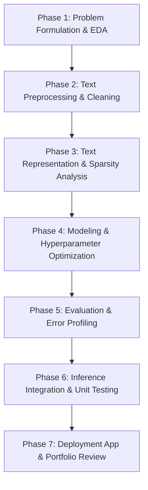

# Project Blueprint: Customer Support Ticket Classification using Traditional NLP and Machine Learning

This document outlines the end-to-end design, modular architecture, and execution roadmap for building a portfolio-grade machine learning and natural language processing system. The target objective is to automatically categorize incoming customer support tickets into distinct product or issue categories using traditional NLP and Machine Learning techniques.

---

## 1. Project Directory Layout & File System Architecture

```text
nlp/
├── .gitignore                   # Excludes large data, model binaries, environments, and caches
├── requirements.txt             # Standardized python dependencies for reproducibility
├── project_blueprint.md         # Full project engineering specification (this document)
├── README.md                    # Portfolio front-page detailing installation, usage, and results
│
├── data/                        # Dataset partitions (version-controlled using Git LFS or ignored)
│   ├── raw/
│   │   └── customer_support_tickets_200k.csv  # Raw input dataset
│   └── processed/
│       ├── .gitkeep
│       ├── train.csv            # Cleaned, tokenized training set (70%)
│       ├── val.csv              # Cleaned, tokenized validation set (15%)
│       └── test.csv             # Cleaned, tokenized holdout test set (15%)
│
├── notebooks/                   # Interactive phase-by-phase prototyping notebooks
│   ├── 01_data_exploration.ipynb
│   ├── 02_text_preprocessing.ipynb
│   ├── 03_text_representation.ipynb
│   ├── 04_model_development.ipynb
│   └── 05_model_evaluation.ipynb
│
├── src/                         # Modular, production-grade codebase
│   ├── __init__.py
│   ├── config.py                # Hyperparameters, file paths, and random seed constants
│   ├── preprocessing.py         # 19 text cleaning and normalization operations
│   ├── feature_engineering.py   # Vectorization methods (TF-IDF, BoW, Hashing Trick, Dimensionality)
│   ├── train.py                 # Cross-validation, grid search, and model fitting workflow
│   ├── evaluate.py              # Performance calculations, confusion matrices, and error logging
│   ├── inference.py             # Deployment-ready low-latency inference class with OOV diagnostics
│   └── utils.py                 # Performance timers, loggers, and corpus downloading scripts
│
├── models/                      # Serialized artifacts
│   ├── .gitkeep
│   ├── best_model.joblib        # Fitted scikit-learn or XGBoost classifier
│   ├── vectorizer.joblib        # Fitted TF-IDF or CountVectorizer object
│   └── label_encoder.joblib     # Target category label encoder
│
├── reports/                     # Visualizations and documents
│   └── figures/                 # Confusion matrices, ROC/PR curves, class distributions
│       └── .gitkeep
│
├── outputs/                     # Text logs and error logs
│   ├── .gitkeep
│   ├── pipeline.log             # Execution logger records
│   └── misclassified_tickets.csv # Output of error profiling from test set
│
├── tests/                       # Unit and integration test suite
│   ├── __init__.py
│   ├── test_preprocessing.py
│   ├── test_feature_engineering.py
│   └── test_inference.py
│
└── app/                         # Demonstration web application
    └── app.py                   # Streamlit interactive classification interface
```

### Folder and File Purpose Details

*   **`data/raw/`**: Holds the original immutable dataset. It must never be modified directly.
*   **`data/processed/`**: Stores training, validation, and test splits after text cleaning has been applied. Decouples exploration and representation from heavy recalculations.
*   **`notebooks/`**: Contains numbered, structured notebooks for visual exploration, testing cleaning steps, analyzing vectorization sparsity, and plotting metrics.
*   **`src/config.py`**: Holds path variables, n-gram bounds, cross-validation parameters, and model search spaces. Changes here propagate instantly across all modules.
*   **`src/preprocessing.py`**: A stateless utility module containing functions for string manipulation and NLP normalization. Reused by both training pipelines and the runtime app.
*   **`src/feature_engineering.py`**: Contains vector transformations. Encapsulates text-to-numeric mapping and sparsity diagnostics.
*   **`src/train.py`**: Script to execute the full model building flow. Orchestrates splits, fits the vectorizer and classifiers, runs GridSearchCV, and saves serialization files to `models/`.
*   **`src/evaluate.py`**: Generates confusion matrix graphs, classification report sheets, and parses prediction confidences to flag error patterns.
*   **`src/inference.py`**: Real-time inference class. Contains logic to preprocess new inputs, transform using the fitted vectorizer, predict class probabilities, and count Out-Of-Vocabulary words.
*   **`src/utils.py`**: Sets up logs and downloads required packages (e.g. NLTK nltk_data) to ensure smooth environment setup.
*   **`models/`**: Serialized model binaries. Checked into `.gitignore` to prevent repository bloat.
*   **`reports/` & `outputs/`**: Contains analysis plots for documentation and tables listing misclassified tickets.
*   **`tests/`**: Contains test scripts run with `pytest` to guarantee that edits to the cleaning functions or vectorizers do not introduce regressions.
*   **`app/`**: Contains the Streamlit app. Emulates a live corporate dashboard.

---

## 2. Phase-by-Phase Roadmap



### Phase 1: Problem Formulation & Exploratory Data Analysis (EDA)
*   **Objectives**: Understand the data distribution, inspect columns, identify target labels (`category`), assess class imbalance, analyze ticket string lengths, and identify potential noise (HTML tags, numbers, codes).
*   **Deliverables**: A clean dataset overview report, target distribution plot, and text-length distribution chart.
*   **Expected Outputs**: Baseline understanding of classes (e.g., "Account Suspension", "Billing Issue", "Product Bug"), identifying null rows, and establishing a multi-class classification problem.
*   **Files Involved**:
    *   `notebooks/01_data_exploration.ipynb`
    *   `data/raw/customer_support_tickets_200k.csv`

### Phase 2: Text Preprocessing & Cleaning
*   **Objectives**: Develop, modularize, and verify a 19-stage preprocessing pipeline to convert noisy support tickets into clean, standardized token sequences. Compare the output of stemming and lemmatization.
*   **Deliverables**: `src/preprocessing.py`, `tests/test_preprocessing.py`, and interactive tests verifying token normalization.
*   **Expected Outputs**: Cleaner text where mentions (e.g., `@customer_support`) are removed or masked, emojis are converted, spelling repetitions are fixed, and roots are extracted.
*   **Files Involved**:
    *   `src/preprocessing.py`
    *   `notebooks/02_text_preprocessing.ipynb`
    *   `tests/test_preprocessing.py`

### Phase 3: Text Representation & Sparsity Analysis
*   **Objectives**: Construct vocabulary from clean training text and transform it into numerical vectors. Compare representation techniques (BoW, N-grams, TF-IDF, Binary vectors, and the Hashing Trick). Perform detailed density/sparsity analyses.
*   **Deliverables**: `src/feature_engineering.py`, `tests/test_feature_engineering.py`, and charts showing term frequency vs IDF weights.
*   **Expected Outputs**: Numeric representations of text, comparative memory analysis of sparse vs dense arrays, and fitted vectorizer configurations.
*   **Files Involved**:
    *   `src/feature_engineering.py`
    *   `notebooks/03_text_representation.ipynb`
    *   `tests/test_feature_engineering.py`

### Phase 4: Modeling & Hyperparameter Optimization
*   **Objectives**: Train and optimize traditional ML estimators (Naive Bayes, Logistic Regression, SVMs, and Gradient Boosting) on training vectors using K-fold cross-validation. Guarantee that no test data leaks into vectorizer fitting or model optimization.
*   **Deliverables**: `src/train.py`, `src/config.py`, and serialized files in `models/`.
*   **Expected Outputs**: Log of search parameters, validation metrics for all models, and joblib binaries for the champion model, vectorizer, and encoder.
*   **Files Involved**:
    *   `src/config.py`
    *   `src/train.py`
    *   `notebooks/04_model_development.ipynb`

### Phase 5: Evaluation & Error Profiling
*   **Objectives**: Assess the champion model on the unseen test partition using accuracy, macro precision, recall, and F1-scores. Generate confusion matrices and multi-class ROC/PR curves. Perform systematic error analysis to identify category overlaps.
*   **Deliverables**: `src/evaluate.py`, `notebooks/05_model_evaluation.ipynb`, performance plots, and an error audit log (`outputs/misclassified_tickets.csv`).
*   **Expected Outputs**: Detailed confusion matrices, ROC/PR curves, a list of tickets where the model made high-confidence mistakes, and business insights.
*   **Files Involved**:
    *   `src/evaluate.py`
    *   `notebooks/05_model_evaluation.ipynb`
    *   `outputs/misclassified_tickets.csv`
    *   `reports/figures/`

### Phase 6: Inference Integration & Unit Testing
*   **Objectives**: Wrap the best model, vectorizer, and label encoder into a deployment-ready inference wrapper. Write unit tests for all components to ensure robustness.
*   **Deliverables**: `src/inference.py`, `tests/test_feature_engineering.py`, and `tests/test_inference.py`.
*   **Expected Outputs**: An executable inference class that handles raw strings, filters out-of-vocabulary (OOV) tokens, and outputs predictions as JSON-like dicts.
*   **Files Involved**:
    *   `src/inference.py`
    *   `tests/`

### Phase 7: Deployment App & Portfolio Review
*   **Objectives**: Create an interactive Streamlit application to demonstrate the model's capabilities. Write a recruiter-ready project README detailing methodology, performance comparison tables, and business takeaways.
*   **Deliverables**: `app/app.py`, `requirements.txt`, and `README.md`.
*   **Expected Outputs**: A live local Streamlit dashboard where users can submit tickets, inspect preprocessing steps, and view classification probabilities.
*   **Files Involved**:
    *   `app/app.py`
    *   `requirements.txt`
    *   `README.md`

---

## 3. Jupyter Notebook Plan

### Notebook 1: `01_data_exploration.ipynb`
*   **Purpose**: Formulate the machine learning problem and perform exploratory data analysis.
*   **Inputs**: `data/raw/customer_support_tickets_200k.csv`
*   **Outputs**:
    *   Visualizations of category counts (checks class imbalance).
    *   Distribution curves of characters and tokens per ticket.
    *   Correlation mappings between metadata features (region, priority) and the ticket category.
*   **Concepts Covered**: Problem formulation, label distribution, data quality auditing, missing value profiling.

### Notebook 2: `02_text_preprocessing.ipynb`
*   **Purpose**: Walk through the text cleaning, tokenization, stemming, and lemmatization pipeline.
*   **Inputs**: Sample slice of `data/raw/customer_support_tickets_200k.csv`
*   **Outputs**:
    *   Comparative tables showing ticket text transformations at each step.
    *   Visual comparisons of word count changes after stopword removal.
    *   Visual contrasts between Stemming (word roots) and Lemmatization (lemmas).
*   **Concepts Covered**: Text normalization, Unicode normalization, spelling variation adjustments, regex masking (emails, URLs, mentions), tokenizations (word/sentence), emoji/emoticon parsing, stemming vs lemmatization, and basic language detection.

### Notebook 3: `03_text_representation.ipynb`
*   **Purpose**: Prototype and analyze various vector representation strategies.
*   **Inputs**: Clean preprocessed text samples.
*   **Outputs**:
    *   Vocabulary size statistics and TF-IDF weight curves.
    *   Density calculations showing the proportion of non-zero elements.
    *   Memory occupancy analyses (sparse matrix vs dense matrix footprint).
    *   Evaluations of the Hashing Trick (collisions and speed).
*   **Concepts Covered**: Bag of Words (BoW), Binary vectors, N-grams, Term Frequency (TF), Inverse Document Frequency (IDF), TF-IDF, Hashing Trick, Sparse vs Dense representations, Dimensionality analysis.

### Notebook 4: `04_model_development.ipynb`
*   **Purpose**: Split datasets, train baseline models, and tune hyperparameters of candidate models.
*   **Inputs**: Preprocessed data splits.
*   **Outputs**:
    *   Cross-validation learning curves.
    *   Model search logs (GridSearchCV records).
    *   Validation performance comparison tables.
*   **Concepts Covered**: Train/Validation/Test splitting, avoiding data leakage (fitting vectorizer *only* on training set), cross-validation, hyperparameter grid searches, model architectures (Naive Bayes, Logistic Regression, Linear & RBF SVMs, Boosting with XGBoost/AdaBoost/Gradient Boosting).

### Notebook 5: `05_model_evaluation.ipynb`
*   **Purpose**: Conduct final evaluations, plot performance curves, and execute a structured error audit.
*   **Inputs**: Serialized model files and the holdout test split.
*   **Outputs**:
    *   Holdout test classification reports.
    *   Confusion matrix heatmaps.
    *   ROC and Precision-Recall multi-class curves.
    *   CSV files listing the top high-confidence classification errors.
*   **Concepts Covered**: Multi-class model evaluation, confusion matrix auditing, AUC metrics, error analysis, translating model predictions into business insights.

---

## 4. Source Code (`src/`) Architecture

### Module 1: `config.py`
Defines project-wide constants, paths, and hyperparameters:
*   `PROJECT_ROOT`, `RAW_DATA_PATH`, `PROCESSED_TRAIN_PATH`, etc.
*   `RANDOM_STATE = 42` (ensures reproducibility across packages).
*   Split ratios (`TEST_SIZE = 0.15`, `VAL_SIZE = 0.15`).
*   Vectorization boundaries (`MAX_FEATURES`, `NGRAM_RANGE`, `MIN_DF`, `MAX_DF`).
*   Hyperparameter search spaces (`HYPERPARAMETER_GRIDS` dict for GridSearch).

### Module 2: `preprocessing.py`
Stateless functions designed to clean and normalize raw string columns:
*   `detect_language(text)`: Flags language code using `langdetect`.
*   `normalize_unicode(text)`: Converts characters to NFKD representation.
*   `handle_contractions(text)`: Expands contractions like *won't* using `contractions` library.
*   `handle_emojis(text)`: Converts emojis (e.g. `😊` -> `smile`) using `emoji`.
*   `mask_entities(text)`: Replaces URLs, emails, and mentions with standard tokens (`<URL>`, `<EMAIL>`, `<MENTION>`).
*   `remove_punctuation_and_numbers(text)`: Removes punctuation and digits.
*   `normalize_whitespace(text)`: Trims whitespace and collapses multiple spaces.
*   `tokenize_sentences(text)`, `tokenize_words(text)`: Splits text using NLTK/SpaCy engines.
*   `remove_stopwords(tokens)`, `apply_stemming(tokens)`, `apply_lemmatization(tokens)`: Processes word tokens.
*   `handle_spelling_variations(tokens)`: Regulates repeated characters (e.g., *pleeease* -> *please*).
*   `preprocess_text(text, method)`: Runs a single string through the full sequence of steps.
*   `preprocess_dataframe(df, text_col, target_col)`: Processes a full DataFrame.

### Module 3: `feature_engineering.py`
Converts processed text into numeric feature matrices:
*   `fit_tfidf_vectorizer(train_texts)`: Fits and returns a `TfidfVectorizer` using training text.
*   `fit_bow_vectorizer(train_texts, binary)`: Fits a `CountVectorizer` (supports BoW or binary counts).
*   `transform_texts(vectorizer, texts)`: Transforms test/validation/production texts. Uses *only* the vocabulary learned from training (correctly tracking out-of-vocabulary words without data leakage).
*   `apply_hashing_trick(texts, n_features)`: Translates tokens using `HashingVectorizer` to show a vocab-free alternative.
*   `extract_vocabulary(vectorizer)`: Returns the feature mapping.
*   `analyze_dimensionality(sparse_matrix, vectorizer)`: Analyzes sparsity, density ratio, and memory usage.

### Module 4: `train.py`
Orchestrates model development and hyperparameter tuning:
*   `load_and_split_data(data_path)`: Performs train/val/test splits before text cleaning.
*   `train_baseline_model(x_train, y_train)`: Fits a baseline Naive Bayes model.
*   `run_grid_search(x_train, y_train, model_type)`: Runs K-Fold cross-validation on Logistic Regression, SVMs, or Boosting models.
*   `save_model_artifacts(model, vectorizer, label_encoder)`: Serializes outputs to `models/` using `joblib`.
*   `train_pipeline()`: Orchestrates the entire training workflow.

### Module 5: `evaluate.py`
Generates performance metrics and files for error analysis:
*   `compute_metrics(y_true, y_pred)`: Returns F1, precision, recall, and accuracy scores.
*   `generate_classification_report(y_true, y_pred, target_names)`: Generates tabular performance breakdowns.
*   `plot_confusion_matrix(y_true, y_pred, target_names, save_path)`: Saves heatmap visualization.
*   `plot_roc_pr_curves(y_true, y_probs, target_names, save_path)`: Visualizes multi-class curves.
*   `perform_error_analysis(df, text_col, y_true, y_pred, y_probs, target_names)`: Flags misclassified instances, sorts them by model confidence, and saves them to `outputs/misclassified_tickets.csv`.

### Module 6: `inference.py`
Deployment wrapper that abstracts preprocessing and classification:
*   `TicketInferencePipeline`:
    *   `__init__(model_path, vectorizer_path, label_encoder_path)`: Loads serialized assets.
    *   `_track_oov_words(raw_text)`: Identifies tokens that were not seen during training.
    *   `predict_single(text)`: Processes a single ticket and returns category probabilities and OOV analysis.
    *   `predict_batch(texts)`: Evaluates a list of strings in batches.

### Module 7: `utils.py`
Helper utilities to keep code execution clean:
*   `setup_logger(name, log_file)`: Streamlines logging across files.
*   `check_nltk_assets()`, `check_spacy_model()`: Downloads packages automatically if missing.
*   `timer_decorator(func)`: Measures preprocessing and training execution times.

---

## 5. NLP Concept Mapping Matrix

| Concept | Implementation File | Notebook Location | Development Phase |
| :--- | :--- | :--- | :--- |
| **Problem Formulation** | `src/train.py` | `01_data_exploration.ipynb` | Phase 1: Problem Formulation |
| **Data Collection** | (Already loaded) | `01_data_exploration.ipynb` | Phase 1: Problem Formulation |
| **Train/Validation/Test Split** | `src/train.py` | `04_model_development.ipynb` | Phase 4: Modeling |
| **Vocabulary Fitting vs Transformation** | `src/feature_engineering.py` | `04_model_development.ipynb` | Phase 4: Modeling |
| **Feature Extraction Workflow** | `src/feature_engineering.py` | `03_text_representation.ipynb` | Phase 3: Text Representation |
| **Model Training** | `src/train.py` | `04_model_development.ipynb` | Phase 4: Modeling |
| **Evaluation** | `src/evaluate.py` | `05_model_evaluation.ipynb` | Phase 5: Evaluation |
| **Inference Pipeline** | `src/inference.py` | `05_model_evaluation.ipynb` | Phase 6: Inference |
| **Handling Unseen Words (OOV)** | `src/inference.py` | `03_text_representation.ipynb` | Phase 3 & Phase 6 |
| **Pipeline Reproducibility** | `src/config.py` | `04_model_development.ipynb` | Phase 4: Modeling |
| **Avoiding Data Leakage** | `src/train.py` | `04_model_development.ipynb` | Phase 4: Modeling |
| **Text Normalization** | `src/preprocessing.py` | `02_text_preprocessing.ipynb` | Phase 2: Preprocessing |
| **Lowercasing** | `src/preprocessing.py` | `02_text_preprocessing.ipynb` | Phase 2: Preprocessing |
| **Unicode Normalization** | `src/preprocessing.py` | `02_text_preprocessing.ipynb` | Phase 2: Preprocessing |
| **Removing Punctuation** | `src/preprocessing.py` | `02_text_preprocessing.ipynb` | Phase 2: Preprocessing |
| **Removing Numbers** | `src/preprocessing.py` | `02_text_preprocessing.ipynb` | Phase 2: Preprocessing |
| **Handling Special Characters** | `src/preprocessing.py` | `02_text_preprocessing.ipynb` | Phase 2: Preprocessing |
| **Whitespace Normalization** | `src/preprocessing.py` | `02_text_preprocessing.ipynb` | Phase 2: Preprocessing |
| **Stopword Removal** | `src/preprocessing.py` | `02_text_preprocessing.ipynb` | Phase 2: Preprocessing |
| **Handling Contractions** | `src/preprocessing.py` | `02_text_preprocessing.ipynb` | Phase 2: Preprocessing |
| **Word Tokenization** | `src/preprocessing.py` | `02_text_preprocessing.ipynb` | Phase 2: Preprocessing |
| **Sentence Tokenization** | `src/preprocessing.py` | `02_text_preprocessing.ipynb` | Phase 2: Preprocessing |
| **Stemming** | `src/preprocessing.py` | `02_text_preprocessing.ipynb` | Phase 2: Preprocessing |
| **Lemmatization** | `src/preprocessing.py` | `02_text_preprocessing.ipynb` | Phase 2: Preprocessing |
| **Handling Emojis & Emoticons** | `src/preprocessing.py` | `02_text_preprocessing.ipynb` | Phase 2: Preprocessing |
| **Handling URLs** | `src/preprocessing.py` | `02_text_preprocessing.ipynb` | Phase 2: Preprocessing |
| **Handling Emails** | `src/preprocessing.py` | `02_text_preprocessing.ipynb` | Phase 2: Preprocessing |
| **Handling Mentions** | `src/preprocessing.py` | `02_text_preprocessing.ipynb` | Phase 2: Preprocessing |
| **Handling Spelling Variations** | `src/preprocessing.py` | `02_text_preprocessing.ipynb` | Phase 2: Preprocessing |
| **Basic Language Detection** | `src/preprocessing.py` | `02_text_preprocessing.ipynb` | Phase 2: Preprocessing |
| **Bag of Words (BoW)** | `src/feature_engineering.py` | `03_text_representation.ipynb` | Phase 3: Text Representation |
| **N-grams** | `src/feature_engineering.py` | `03_text_representation.ipynb` | Phase 3: Text Representation |
| **Term Frequency (TF)** | `src/feature_engineering.py` | `03_text_representation.ipynb` | Phase 3: Text Representation |
| **Inverse Document Frequency (IDF)**| `src/feature_engineering.py` | `03_text_representation.ipynb` | Phase 3: Text Representation |
| **TF-IDF** | `src/feature_engineering.py` | `03_text_representation.ipynb` | Phase 3: Text Representation |
| **Binary Vectors** | `src/feature_engineering.py` | `03_text_representation.ipynb` | Phase 3: Text Representation |
| **Hashing Trick** | `src/feature_engineering.py` | `03_text_representation.ipynb` | Phase 3: Text Representation |
| **Vocabulary Creation** | `src/feature_engineering.py` | `03_text_representation.ipynb` | Phase 3: Text Representation |
| **Sparse vs Dense Representations**| `src/feature_engineering.py` | `03_text_representation.ipynb` | Phase 3: Text Representation |
| **Dimensionality Analysis** | `src/feature_engineering.py` | `03_text_representation.ipynb` | Phase 3: Text Representation |
| **Naive Bayes** | `src/train.py` | `04_model_development.ipynb` | Phase 4: Modeling |
| **Logistic Regression** | `src/train.py` | `04_model_development.ipynb` | Phase 4: Modeling |
| **Support Vector Machines (SVM)** | `src/train.py` | `04_model_development.ipynb` | Phase 4: Modeling |
| **Boosting Algorithms (XGBoost)** | `src/train.py` | `04_model_development.ipynb` | Phase 4: Modeling |

---

## 6. Experiment Tracking, Reproducibility, & Leakage Prevention

### Ensuring Full Reproducibility
1.  **Fixed Random Seed**: Configure a single random seed (`RANDOM_STATE = 42`) in `src/config.py` and propagate it to scikit-learn classifiers, XGBoost, and pandas/scipy splitters.
2.  **Environment Declarations**: Fix library versions inside `requirements.txt`.
3.  **Automatic Resource Management**: Use NLTK/SpaCy asset checking functions inside `src/utils.py` to ensure dependency runtimes download corpora automatically if missing.

### Preventing Data Leakage
Data leakage is a critical failure point in NLP pipelines. To prevent it:
*   **Split Before Cleaning/Fitting**: Perform the train/validation/test split before fitting vectorizers or applying class label encoders.
*   **Fit Only on Train**: Fit the `TfidfVectorizer` (or `CountVectorizer`) and `LabelEncoder` **only** on the training set. Never call `.fit()` or `.fit_transform()` on validation or test sets. Use `.transform()` for these.
*   **Zero Leakage in Preprocessing**: Global statistics (like average document lengths used for outliers) must be calculated on the training partition and applied to others as constants.

### Experiment Tracking
*   **Logs**: Log execution records to `outputs/pipeline.log`. Write metrics, best parameters, and sparsity analyses to stdout and text logs using `logging`.
*   **Model Versioning**: Include hyperparameter summaries in the file names of serialized models (e.g., `logistic_regression_c1.0.joblib`) or use `best_model.joblib` to store the champion model.

---

## 7. Portfolio Recommendations & Visualizations

A strong portfolio project must visually demonstrate and translate technical outputs into business metrics:

### Visualizations
1.  **Class Distribution Plot**: A horizontal bar chart showing the frequency of ticket categories. Highlights class imbalance.
2.  **Sparsity vs Memory Plot**: A line chart showing the memory footprint of text matrices as maximum features increase (comparing dense numpy arrays to sparse scipy CSR matrices).
3.  **Most Discriminative N-grams**: A chart displaying the top 10 tokens per class sorted by TF-IDF scores, illustrating that the vectorizer successfully extracted key words.
4.  **Confusion Matrix Heatmap**: A normalized confusion matrix heatmap showing true vs predicted categories.
5.  **ROC and Precision-Recall Curves**: Multi-class curves showing area under the curve metrics.

### Systematic Error Analysis
To show machine learning maturity, perform a structured error analysis:
*   Generate `outputs/misclassified_tickets.csv` listing the original text, true class, predicted class, and prediction probability.
*   Sort this file by **confidence** (prediction probability) in descending order to identify cases where the model was highly confident but incorrect.
*   *Business Takeaway*: These errors usually flag ambiguous class labels (e.g., customers confusing "Account Access" with "Billing Refund"), which can help guide updates to support guidelines.

### Business Value Metrics
Translate F1-scores into business impact metrics:
*   **Automated Routing Efficiency**: Calculate estimated time saved assuming tickets classified with $>90\%$ probability are routed automatically (zero-touch routing).
*   **Average Handling Time (AHT)**: Estimate AHT reductions from prepopulating ticket categories before a support representative opens the ticket.

---

## 8. Deployment-Ready Inference Pipeline Architecture

```text
                               +-----------------------------+
                               |     Incoming Request        |
                               | (Raw Ticket Text / String)  |
                               +--------------+--------------+
                                              |
                                              v
                               +--------------+--------------+
                               |    Inference Pipeline       |
                               |  - Normalization            |
                               |  - Entity masking           |
                               |  - SpaCy Lemmatizer         |
                               +--------------+--------------+
                                              |
                                              v
                               +--------------+--------------+
                               |    Feature Engineering      |
                               |  - TF-IDF Vector transform   |
                               |  - Count OOV tokens         |
                               +--------------+--------------+
                                              v
                               +--------------+--------------+
                               |      Champion Model         |
                               |  - Predict probabilities    |
                               |  - Select highest class     |
                               +--------------+--------------+
                                              |
                                              v
                               +--------------+--------------+
                               |       JSON Response         |
                               |  - Predicted Category       |
                               |  - Probability Dist         |
                               |  - OOV Diagnostic Map       |
                               +-----------------------------+
```

### Production Integration Details
*   **Low Latency Preprocessing**: The inference module imports `preprocess_text` directly. For high-throughput requirements, disable NLTK's tagger/parser dependencies or use a light lemmatizer config.
*   **Handling Unseen Words (OOV)**: The vectorizer uses a fixed vocabulary. When transforming new texts, any tokens not seen during training are ignored. The `_track_oov_words` function intercepts these to output how much of the customer input was out-of-vocabulary, which can help detect language shifts or new issues.
*   **API Response Structure**:
    ```json
    {
      "predicted_category": "Billing & Payments",
      "confidence": 0.942,
      "probabilities": {
        "Billing & Payments": 0.942,
        "Account Suspension": 0.031,
        "Product Bug": 0.018,
        "General Inquiry": 0.009
      },
      "oov_analysis": {
        "oov_ratio": 0.045,
        "oov_words": ["refundapp", "chargeback2026"]
      }
    }
    ```

---

## 9. Phase Deliverables Checklist

### Phase 1: Problem Formulation & EDA
- [x] Columns loaded and verified
- [x] Missing values analyzed
- [x] Category frequency plotted for class imbalance
- [x] Sentence and character distributions reviewed

### Phase 2: Preprocessing
- [x] Accent strings normalized with Unicode NFKD
- [x] Numbers and punctuation stripped
- [x] Emojis, URLs, emails, and mentions masked or handled
- [x] Spelling variations standardized
- [x] Stemming vs Lemmatization compared on sample tokens
- [x] `pytest tests/test_preprocessing.py` executes successfully

### Phase 3: Text Representation
- [x] CountVectorizer, TfidfVectorizer, and HashingVectorizer pipelines created
- [x] Sparsity statistics evaluated
- [x] Memory footprint metrics compared
- [x] `pytest tests/test_feature_engineering.py` executes successfully

### Phase 4: Modeling
- [x] Train/Val/Test splits executed
- [x] Vectorizer fit only on training split
- [x] Baselines established using Naive Bayes
- [x] Hyperparameter grids searched using GridSearchCV and K-fold CV
- [x] Best model saved to `models/`

### Phase 5: Evaluation
- [x] Classification report calculated on test split
- [x] Confusion matrix heatmap generated
- [x] ROC/PR curves plotted
- [x] Misclassified tickets logged to `outputs/misclassified_tickets.csv`
- [x] Business impact metric calculations compiled

### Phase 6 & 7: Inference & Deployment App
- [x] `TicketInferencePipeline` class built and tested
- [x] Out-of-vocabulary (OOV) logic integrated
- [x] `pytest tests/test_inference.py` executes successfully
- [x] Streamlit interface built in `app/app.py`
- [x] Portfolio README.md created

